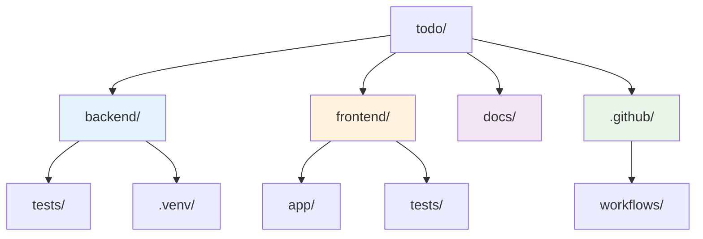

# プロジェクト構成

このドキュメントでは Todo プロジェクトのフォルダ構成と各ディレクトリの役割を説明します。

## フォルダ構成

## ディレクトリ説明

### `backend/`

Python Flask で実装されたバックエンド API。

- **`app.py`**: Flask アプリケーションのエントリーポイント。タスク CRUD エンドポイントを定義。
- **`pyproject.toml`**: Python プロジェクトの依存関係とツール設定。
- **`tests/`**: Pytest によるバックエンド API のテストコード。

### `frontend/`

Next.js 14 + TypeScript で実装されたフロントエンド UI。

- **`app/`**: Next.js App Router のページとレイアウト。
  - `page.tsx`: メインの Todo UI コンポーネント。
  - `layout.tsx`: アプリケーション全体のレイアウト。
  - `globals.css`: Tailwind CSS のグローバルスタイル。
- **`tests/`**: Playwright による E2E テスト。
- **`package.json`**: npm 依存関係とスクリプト定義。
- **`next.config.mjs`**: Next.js の設定ファイル。
- **`tailwind.config.ts`**: Tailwind CSS の設定。

### `docs/`

MkDocs で管理されるプロジェクトドキュメント。

- **`architecture.md`**: システムアーキテクチャの説明。
- **`tech-stack.md`**: 採用技術スタックの詳細。
- **`coding-guidelines.md`**: コーディング規約。
- **`index.md`**: ドキュメントのトップページ。

### `.github/`

GitHub Actions ワークフロー定義。

- **`workflows/`**: CI/CD パイプライン。
  - `deploy-pages.yml`: MkDocs ドキュメントを GitHub Pages に自動デプロイ。

### ルートファイル

- **`mkdocs.yml`**: MkDocs の設定ファイル。サイト構成とテーマを定義。
- **`README.md`**: プロジェクトの概要とセットアップ手順。
- **`uv.lock`**: Python 依存関係のロックファイル（uv によって管理）。

## 補足

このプロジェクトはモノレポ構成を採用しており、フロントエンド・バックエンド・ドキュメントを単一リポジトリで管理しています。各コンポーネントは独立して開発・テスト可能ですが、統合的な変更も容易に追跡できます。
